# LeoTalk AI周知 1: 新信息排泄物实验
# LeoTalk AI Weekly 1: An Experiment in Information Excretion

这是我在尝试的一个每周资讯汇总的栏目，根因是自己摄入的信息太多了，但是越来越没有时间去支撑我做高密度的信息输出了，我转向寻求低频高质量的信息输出模式。这个内容算是这个模式里的一个专栏，主要用于汇集过去一周我看到的一些我觉得有价值的信息，主要以科技和AI为主，会相对垂直一点，这样有助于让感兴趣的人专注在这份有价值的信息上。目前还处于探索和尝试阶段，这周末又特别的忙，现在已经是半夜1点多了，我在周末忙完了一切我认为必须要做的事情之后，自己花了几个小时把信息规整完毕输出，算是赶鸭子上架了，我觉得有很多事情都是倒逼着去做反而能在高压下产出不错的东西，这也是我觉得Just Do It的精髓，不要追求完美，只需要开始即可。希望本文对你有所帮助，有任何想法和反馈都欢迎。

# 技术研究/技术突破

## Thinking Machines发布文章探讨解决大模型推理非确定性问题

Thinking Machines发布了[Defeating Nondeterminism in LLM Inference](https://thinkingmachines.ai/blog/defeating-nondeterminism-in-llm-inference/)，文章揭示了大模型推理中非确定性的真正根源在于批量大小变化导致的算子非批量不变性（而非简单的并发+浮点非结合性），并提出通过设计批量不变的RMSNorm、矩阵乘法和注意力算子来实现真正可复现的确定性推理。

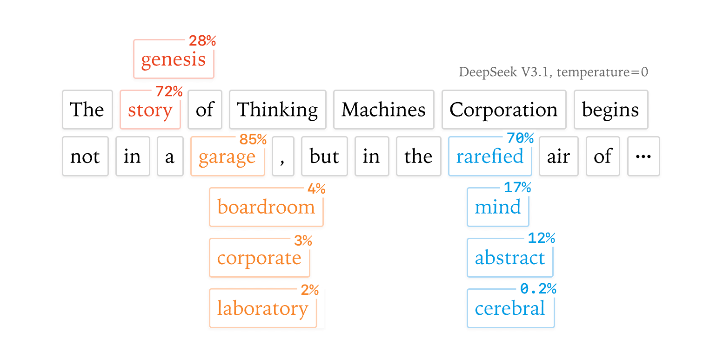

## xAI发布Grok 4 Fast

xAI[发布](https://x.ai/news/grok-4-fast)了Grok 4 Fast，从名字能看出来，就是快！关键点：

- 高性价比推理模型，定位更小更快更便宜的SOTA模型
- 与Grok4性能接近，减少40%的Token消耗
- 推理+非推理模型融合，通过系统提示词切换
- 200万上下文长度！
- 原生工具使用（RL训练过）

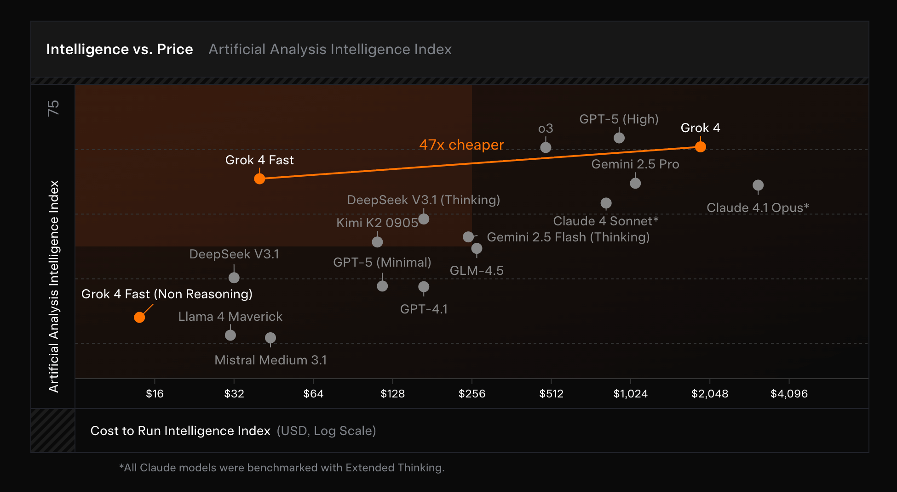

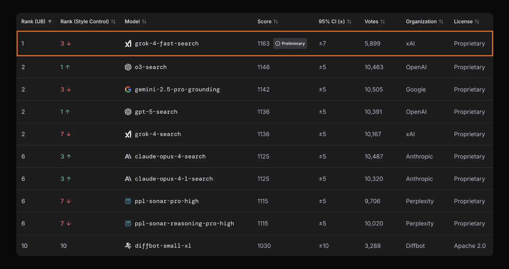

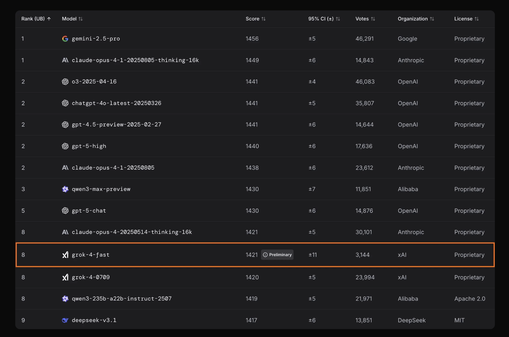

## 千问发布通义Deep Research

千问[发布](https://tongyi-agent.github.io/blog/introducing-tongyi-deep-research/)[Tongyi Deep Research](https://github.com/Alibaba-NLP/DeepResearch)（开源），效果和OpenAI DeepSearch持平

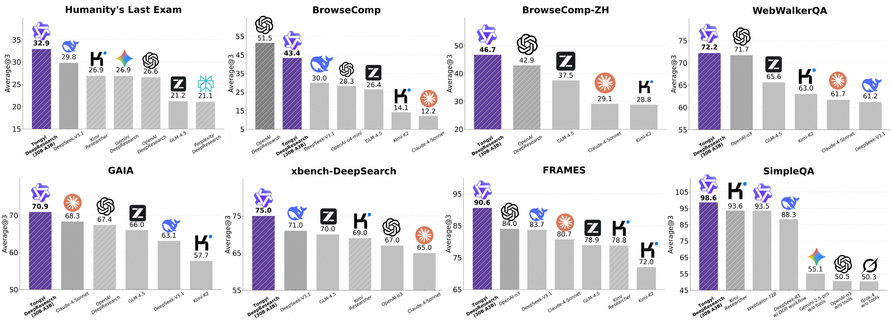

关键点：

- 首个开源对标SOTA效果的DeepResearch
- 全链路合成数据（无人工标注）：从预训练、SFT 到 RL
- 提出了Agentic CPT（Continual Pre-training，持续预训练）+ IterResearch（避免上下文污染）
- 数据飞轮：自动生成博士级复杂问题，迭代升级
- 发现高质量合成数据+稳定环境比算法本身更关键
- 已经在实际的生产环境中使用了：高德小高和通义法睿

## OpenAI在ICPC夺魁

OpenAI在ICPC（国际大学生程序设计竞赛，International Collegiate Programming Contest）中超越人类，取得了12/12的满分战绩，而Google的Gemini2.25 Deep Think只解决了10道题（获得第二名）。

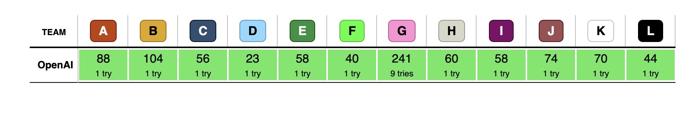

背景信息：来自100多个国家的139所大学参赛，但没有任何人类队伍能拿到满分。OpenAI 在首轮就解出了11道题，并在第9次尝试时攻克了最难的一题。

*Opinion：有一些有数学竞赛背景的人对这个新闻细思极恐，很多人说大模型没有思考能力，但是这些数学竞赛的题目被一个预测Token的模型解决，还是非常震惊人的，或许我们对于大模型涌现后的能力的认知还是太少了，可解释性不足。*

## OpenBMB推出了VoxCPM

https://x.com/OpenBMB/status/1968205159949107502

TTS，只有0.5B参数量，但是效果听起来还是不错的

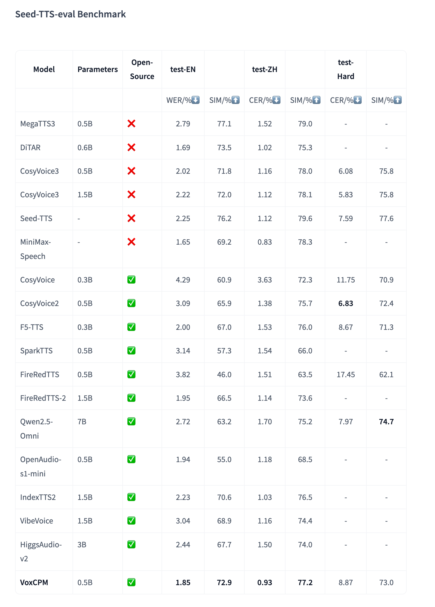

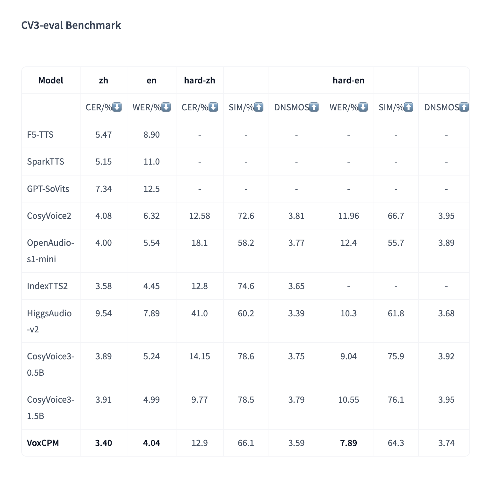

## vLLM推出Semantic Router

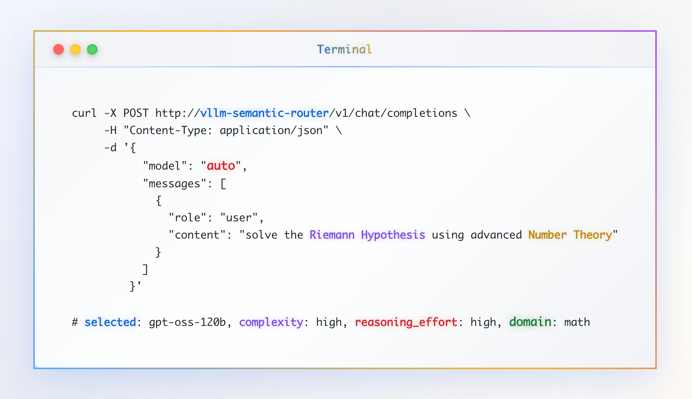

> Intelligent Mixture-of-Models Router for Efficient LLM Inference
>

**路由模型**，简单说就是类似OAI的Switcher，用于根据问题路由到不同的模型，可以大小模型、推理模型等混合使用。

很好理解，毕竟OAI用GPT-5糟糕的发布教会我们什么是路由模型。关键点是：效果、成本和安全：

- 简单请求可以让小模型处理，速度更快且成本更低。诸如你好，谢谢这类简单问题在Chat场景是非常常见且占比不小
- 一些复杂问题用大参数甚至推理模型来处理，有更好的效果。甚至有一个反直觉的，复杂任务用更“便宜”的模型，也就是参数小的模型来处理，实际上在推理密集的任务里反而更贵，且效果可能更不好
- 再进一步，就是专门的任务专门的模型来处理，效果的提升
- 会利用一下jailbreak的数据集来训练，可以分辨一些安全问题

做个不恰当的比喻，类比MoE模型的门控网络（Gating Network）去分流激活对应的专家（Experts）。路由模型的范式有点类似外化了这个能力，虽然本质上这两个不是一个东西，不过理念会有一点点交集。

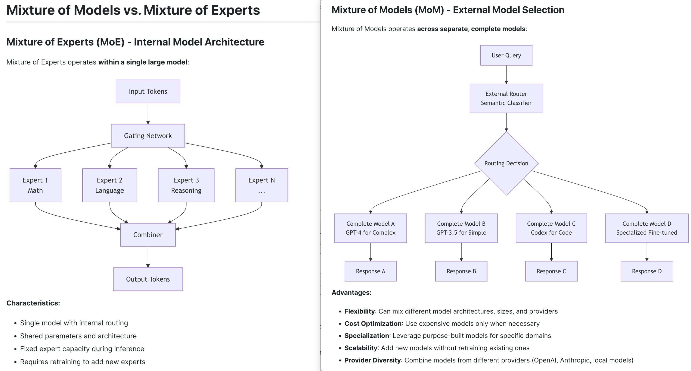

另外这类路由模型通常会基于Encoder模型（适合做分析、分类、检索任务的）来做，比如这里用的[ModernBERT](https://arxiv.org/abs/2412.13663)是一个Encoder-only的Transformer模型。

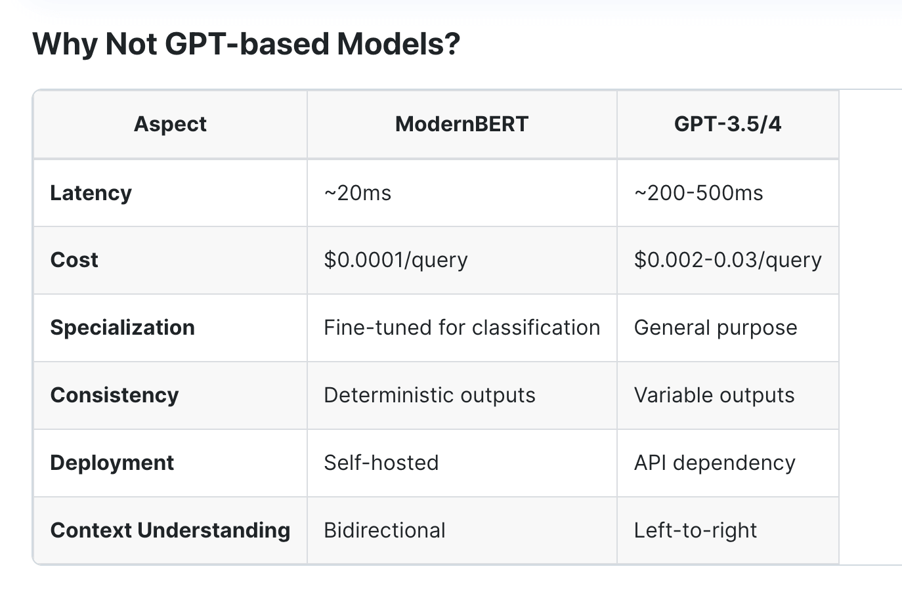

官方网站：https://vllm-semantic-router.com/

官方Repo：https://github.com/vllm-project/semantic-router

vllm也分享了[模型训练相关的内容](https://vllm-semantic-router.com/docs/training/training-overview)，我也随手收集了一些相关的路由模型和数据集：

- https://huggingface.co/datasets/qgyd2021/few_shot_intent_sft
- https://huggingface.co/AdamLucek/ModernBERT-large-llm-router
- https://huggingface.co/datasets/DevQuasar/llm_router_dataset-synth
- [Finetuning ModernBERT Large for LLM Router Classification](https://colab.research.google.com/drive/1G7oHp_8R4fmOSpjwaNB_T2NUJsmMh4Kw)这个Notebook一步步说明了如何基于ModernBERT微调出路由模型，值得一看！
- https://huggingface.co/datasets/Muhammad2003/routing-dataset
- https://github.com/MuhammadBinUsman03/Query-Router
- https://huggingface.co/datasets/jackhhao/jailbreak-classification

# 产品&模型发布

## Claude Code降智的背后：三次故障

8月份以来非常多人陆陆续续感受到Claude Code降智了，并且持续没有好转，关于原因或者动机，充满了各种猜测。9月17日Anthropic[发布](https://x.com/_thomasip/status/1968419157755453812)了一篇[故障报告](https://www.anthropic.com/engineering/a-postmortem-of-three-recent-issues)讲述了这一个多月时间内发生的3起AI Infra的故障，时间线如下：

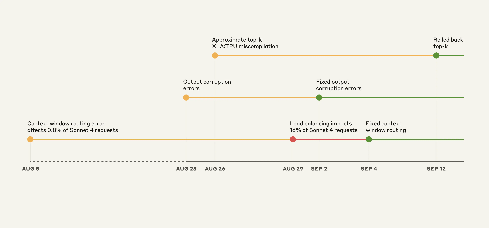

Anthropic有一方API、AWS Bedrock、Google Cloud Vertex AI三个渠道，并且有多个模型，3个问题分别影响的也不同。总结来说三个问题的原因是：

1. **上下文窗口路由错误**：短上下文请求被错误地路由到长上下文服务器，导致输出质量下降
2. **输出损坏**：升级了TPU配置（优化运行时性能），但是错误配置会偶尔让低概率token获得异常高概率，生成了错误语言内容、乱码、错误代码或不合语境的内容。
3. **Approximate top-k 编译错误**：TPU 编译器的混合精度bug让近似top-k算法有时丢掉了最高概率 token，输出完全偏离预期（或者说错误）的结果。

近年来AI高速发展，很多因为AI Infra经验不足或者解决方案不够成熟导致的事故不少，AI可观测性的重要程度也不断提升，一个是反哺AI去提升性能和效果，另一个是可提早发现问题、加速定位问题的作用。另外就是从确定性到非确定性的范式转变，导致一些测试的覆盖变得更加的困难了，AI在一定的范围内也有“能动性”，可以应对某些测试的覆盖。这些

*Opinion：首先是技术报告或者说复盘报告，应该学一下Cloudflare，Anthropic这篇写的含糊其辞，细节不展示，具体问题不披露，让人有一种在用户流失后出来发挥公关作用的文章。Codex+GPT5这波顺利承接了CC流失的用户，有一点几个月前CC承接Cursor用户的即视感。这段时间挺感慨反垄断法存在的必要性，市场充分竞争下，不仅能保证技术和服务的持续进步，也能让消费者有选择，不至于被捆绑和裹挟。*

## OpenAI推出GPT-5-Codex模型

OAI[发布](https://openai.com/index/introducing-upgrades-to-codex/)了GPT‑5-Codex模型，专为AI编程的GPT-5变体版本（目前官方声称的是GPT-5的一个版本，没有明确说明是一个微调版本），目前在Codex中可以使用，但是API还没上线。

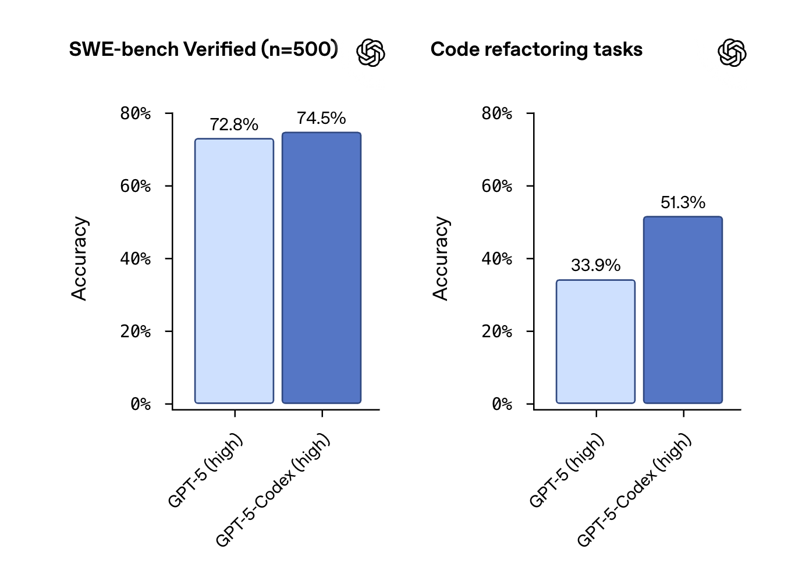

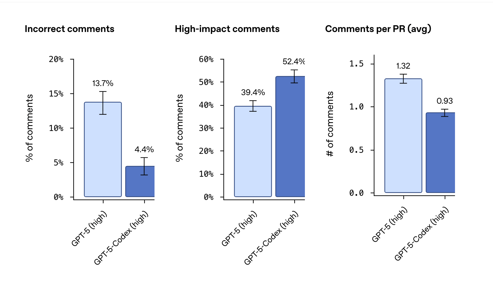

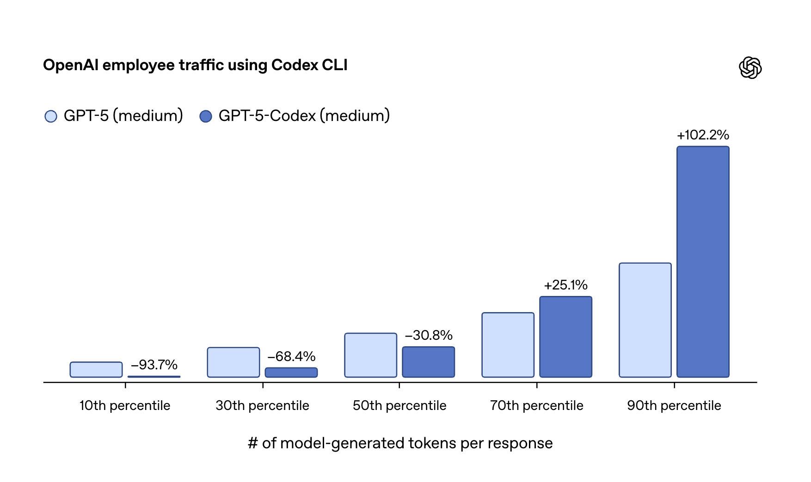

一些关键点：

- 基准测试优于GPT-5，重构任务上提升明显
- 动态调整推理时间：简单任务更快完成，Token消耗量减少94%；复杂问题上多投入2倍推理时间，最长可自主运行7小时！
- 针对代码Review专门训练过，内置的代码审查功能能浏览完整代码库、执行测试、验证依赖

*Opinion：官方论坛里也有人将动态调整能力类比ChatGPT里的Switcher，也就是效果不尽人意，比不上GPT-5 High，因此自己测试才是王道，尝试过才知道。总体而言是个好的趋势，Codex主要用来和Anthropic的Claude竞争了，对消费者是很好的*

## Chrome推出新AI特性

Chrome[宣布](https://x.com/googlechrome/status/1968721681129566379)针对美国用户推出了AI特性，侧边栏形式。市面上已经有Comet、Arc、Dia、Brave之类的AI浏览器，看Google这次如catch up，是抄作业还是创新，拭目以待。（也可以看官方Blog的[文章](https://blog.google/products/chrome/new-ai-features-for-chrome/)）

## AP2

Google[推出](https://cloud.google.com/blog/products/ai-machine-learning/announcing-agents-to-payments-ap2-protocol)了[AP2](https://github.com/google-agentic-commerce/AP2)（Agent Payment Protocol）的开放协议，让AI Agent可以在用户授权的情况下安全完成支付，目前有60多家金融和科技巨头加入支持，美国运通、万事达、PayPal等也为其背书。

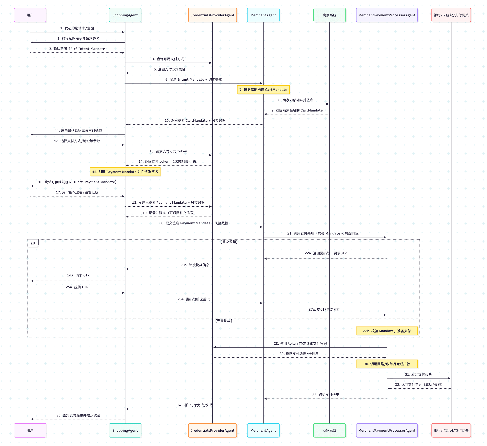

主要包含的角色：

- **购物代理（Shopping Agent）**：主要的协调者，负责处理用户的购物请求，并将任务分配给其他专业代理。
- **商户代理（Merchant Agent）**：处理来自购物代理的商品查询。
- **商户支付处理代理（Merchant Payment Processor Agent）**：代表商户进行支付。
- **凭证提供者代理（Credentials Provider Agent）**：保存用户支付凭证的代理，主要职责：
    - 为购物代理提供用户钱包中的可用支付方式列表。
    - 协助购物代理与商户支付处理方完成支付。

## 腾讯推出了浑元3D 3.0

具备3倍精度提升、1536³ 几何分辨率，以及 36 亿体素超高清建模。搞笑花絮，发[英文推](https://x.com/TencentHunyuan/status/1967873084960260470)，[官网](https://3d.hunyuan.tencent.com/)只能中文，蚌埠住了

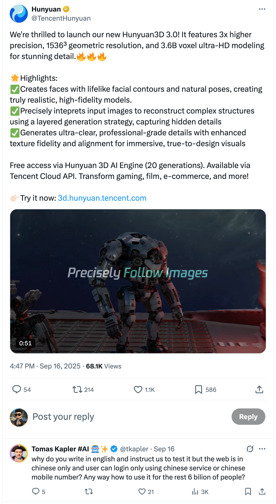

# Meta发布新眼镜

Meta[发布](https://www.meta.com/ae/ai-glasses/)三款新眼镜：**Ray-Ban Display**（799🔪起）、**Ray-Ban Meta (Gen 2)**（379🔪起）和**Oakley Meta Vanguard**（499🔪起）。其中Meta Ray-Ban Display右镜片带有内置显示屏 (in-lens display)，另外还搭配有腕带（Neural Band），支持通过语音和手势控制

*Opinion：发布会翻车了，不过依然掩盖不住小扎的野望，眼镜的场景更多还是在录像拍照，也就是之前最多使用的运动场景，用于取代GoPro之类的运动相机上有优势。另外电池技术还需要再飞一会。最后就是不知道有没有考虑过没戴眼镜的人的感受*

# 投资&商业

## NVIDIA投资Intel $5b

Nvidia[宣布](https://www.wsj.com/tech/ai/nvidia-intel-5-billion-investment-ad940533)投资Intel 50亿🔪（以23.28🔪每股的价格购买普通股），消息后Intel股票涨到30🔪，Nvidia这笔投资已经是正收益了。宣布投资后也[Nvidia](https://nvidianews.nvidia.com/news/nvidia-and-intel-to-develop-ai-infrastructure-and-personal-computing-products)和[Intel](https://newsroom.intel.com/artificial-intelligence/intel-and-nvidia-to-jointly-develop-ai-infrastructure-and-personal-computing-products)共同宣布要在数据中心和个人计算产品上联合开发AI基础设施和PC产品

# 热点论文

- [K2-Think: A Parameter-Efficient Reasoning System](https://arxiv.org/abs/2509.07604)
- [DeepDive: Advancing Deep Search Agents with Knowledge Graphs and Multi-Turn RL](https://arxiv.org/abs/2509.10446)
- [Is In-Context Learning Learning?](https://arxiv.org/abs/2509.10414)
- [Towards General Agentic Intelligence via Environment Scaling](https://arxiv.org/abs/2509.13311)
- [Collaborative Document Editing with Multiple Users and AI Agents](https://arxiv.org/abs/2509.11826)
- [DeepSeek-R1 incentivizes reasoning in LLMs through reinforcement learning](https://www.nature.com/articles/s41586-025-09422-z)
- [Generative Data Refinement: Just Ask for Better Data](https://arxiv.org/abs/2509.08653)

# 其他阅读

- [**自主机器人比你想象的更近（YouTube视频）**](https://www.youtube.com/watch?v=48pxVdmkMIE)：顶尖机器人学者、Physical Intelligence 联合创始人 Sergey Levine 认为，完全自主机器人的实现已近在眼前，行业正处于“自我改进飞轮”的临界点。
- [How to Build Agentic AI 2 (with frameworks) [Agents]](https://artificialintelligencemadesimple.substack.com/p/how-to-build-agentic-ai-2-with-frameworks)：Devansh分享的关于如何构建AgenticAI的方法以及框架
- [ToddlerBot: Open-Source ML-Compatible Humanoid Platform for Loco-Manipulation](https://toddlerbot.github.io/)：一款低成本、开源的人形机器人，用于AI与机器人研究。

## OpenAI和Anthropic的AI使用报告

[OpenAI](https://openai.com/index/how-people-are-using-chatgpt/)和Anthropic在同一天（2025年9月15日）发布了AI使用报告，很容易让人联想到是不是越好了一起发的：

- [How People Use ChatGPT](https://cdn.openai.com/pdf/a253471f-8260-40c6-a2cc-aa93fe9f142e/economic-research-chatgpt-usage-paper.pdf)
- [Anthropic Economic Index: Tracking AI's role in the US and global economy](https://www.anthropic.com/research/economic-index-geography)

篇幅特别长，数据量很多，我汇总了一下大概关键信息如下

**OpenAI的：**

- 性别差距缩小：2024年初女性用户占比 37%，到2025年中已上升到 52%，几乎与总体人口结构一致
- 全球普及：在低收入和中等收入国家的增长速度是高收入国家的4倍以上
- 年轻人主力：近一半成年用户的消息来自18–25岁群体
- 整体分布：约70%用于个人生活，30%与工作相关
- 主要用来做三个类型的任务：Asking（提问/寻求建议）49%，Doing（执行/任务完成）40%，Expressing（表达/探索）11%
- 具体任务：写作是最主要的工作场景（40%）但2/3是编辑、润色或翻译，而非从零写作；编程较少（4.2%）；关系/朋友聊天和（1.9%）游戏/角色扮演更少（0.4%）；日常指导和信息查询（70%） 的整体使用
- 个人用途快速超越工作：从2024年的53%占比到2025年的73%。

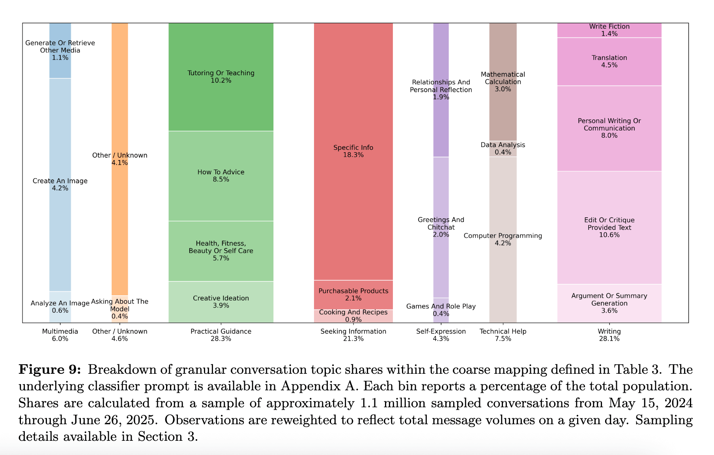

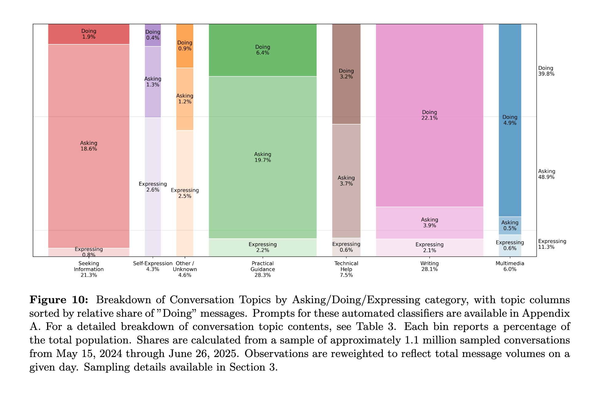

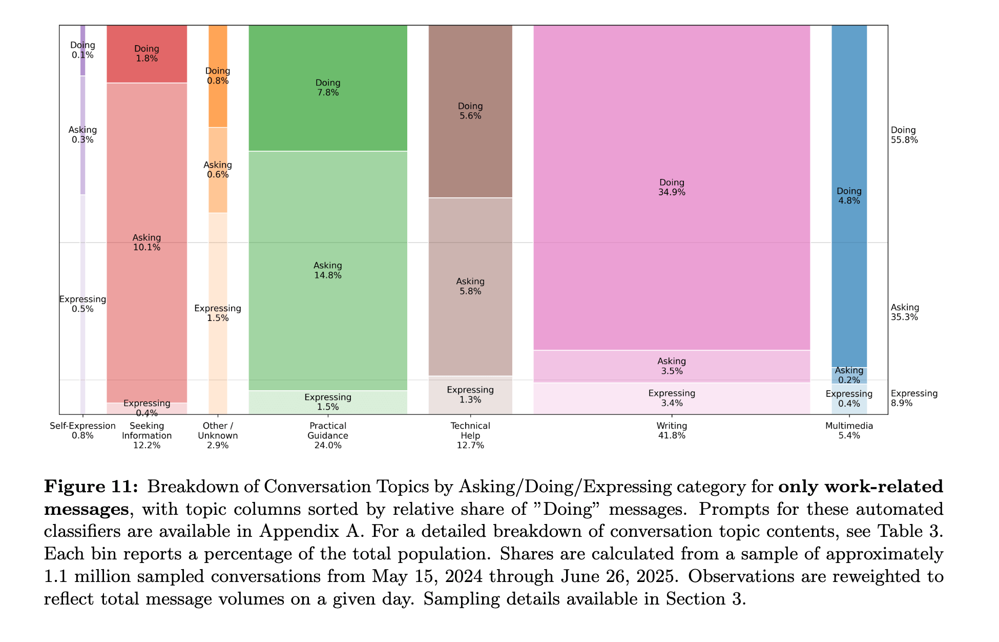

**Anthropic的：**

美国是最多人使用的国家（合规国家范围内）

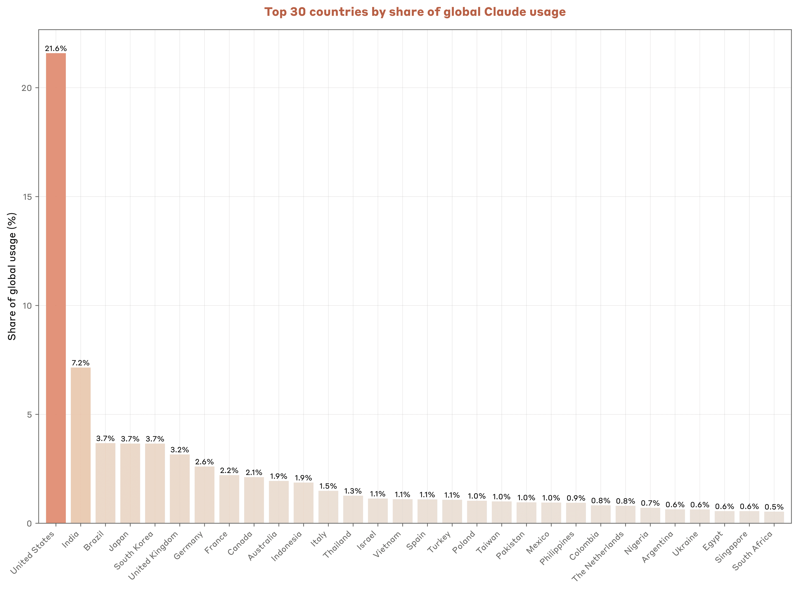

AUI(**Anthropic AI Usage Index**)=使用人数/该国劳动人口。经济水平越高的地区，这个数值约大，有正相关效应（人均GDP每增加1%，AUI大约增加0.7%），似乎也引发了经济分发的趋势（国家或地区间贫富差距和新技术加成造成的马太效应）

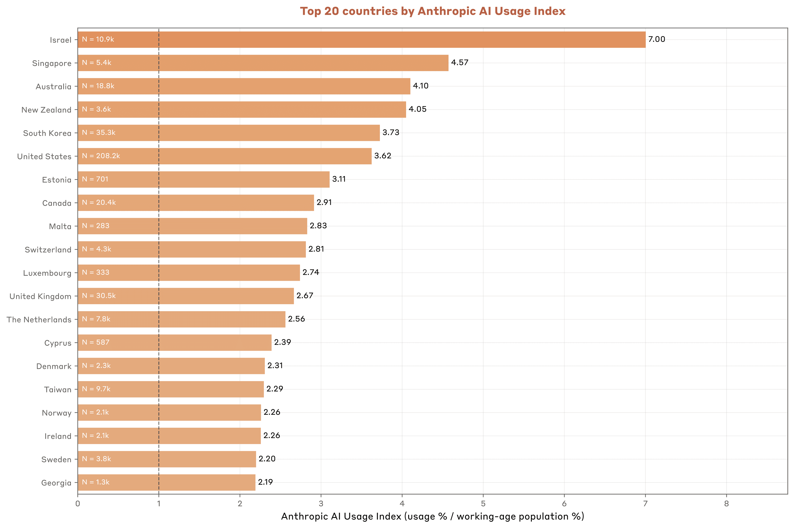

美国各州使用情况和人均GDP也有很大正相关，但是其他因素（如产业结构）也很重要。一些有代表性的州的使用AI完成的任务情况：

- 华盛顿特区：AUI最高，任务主要是文档编辑和信息检索
- 加州：编程任务占比高
- 纽约：金融相关任务占比高
- 夏威夷：旅游相关任务使用率是全美平均的两倍

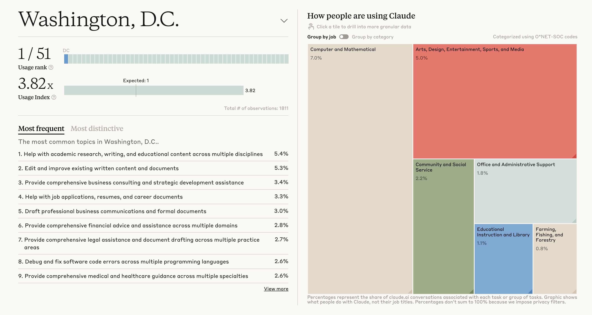

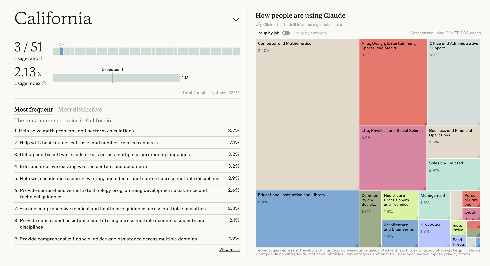

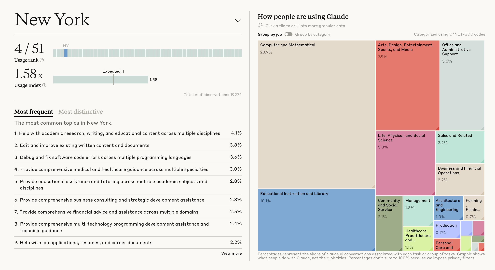

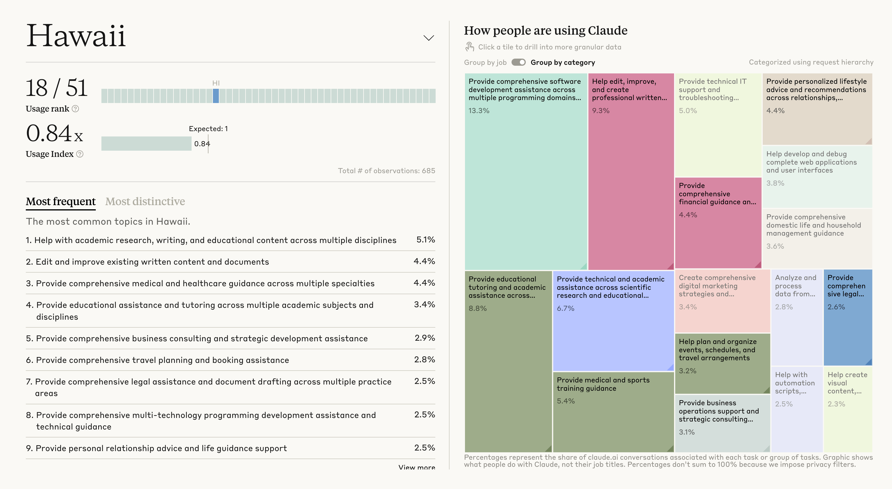

相比于去年，使用趋势也发生了一些变化：

- 计算机和数据任务占比接近一半：37-40%
- 过去9个月，知识密集型领域增长明显：教育9%-13%（+40%），物理和社会科学6%-8%（+33%）
- 自动化任务（AI独立完成49.1%）超过增强任务（人机协作47%）

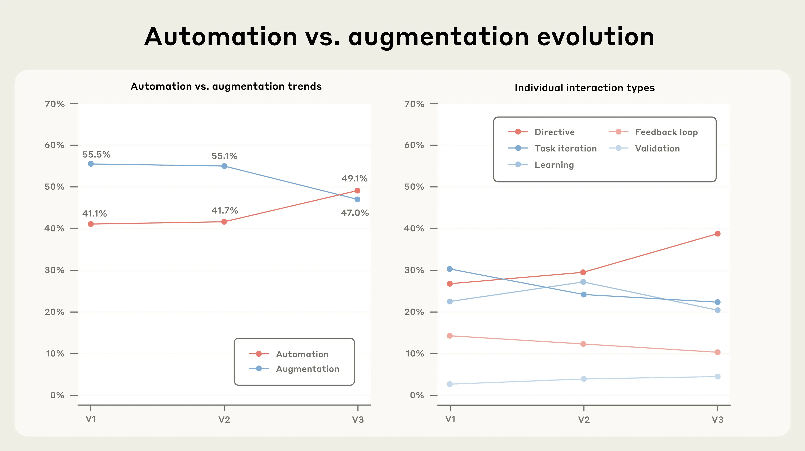

走API（主要企业或开发者）和直接通过ChatBot（普通用户、开发者和企业）使用模式有差异：

- API主要集中在编程和行政任务，占比44%（Claude.ai为36%）
- API77%自动化，Claude.ai只有约一半
- API在高成本任务上使用更频繁。对于企业来说，模型能力和模型产生的经济价值比完成任务所需的成本来的更加重要

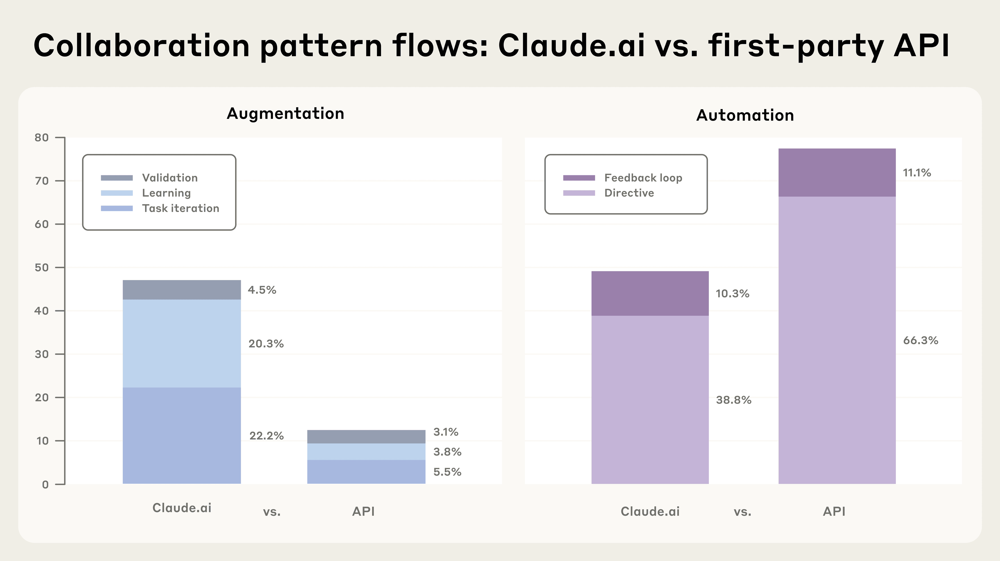

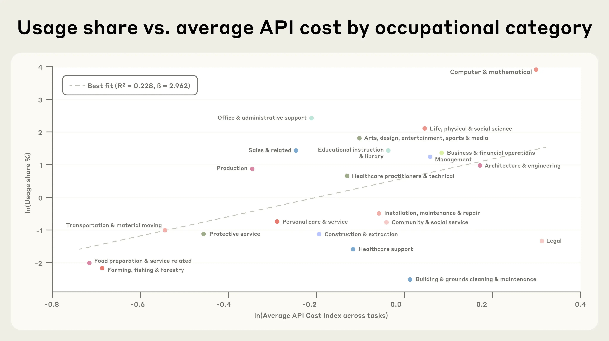