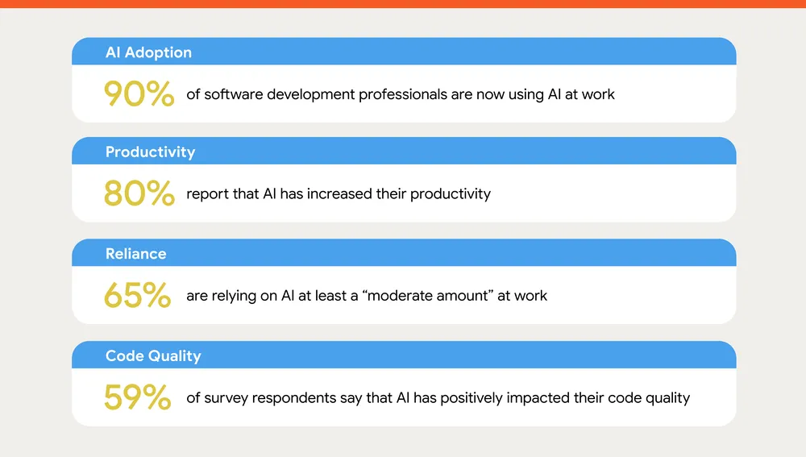
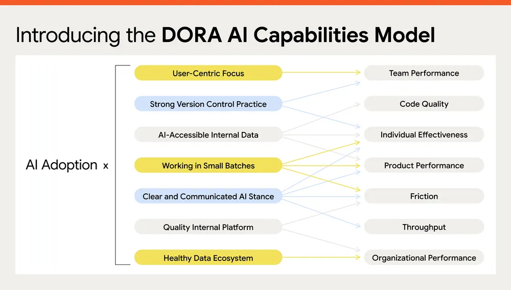
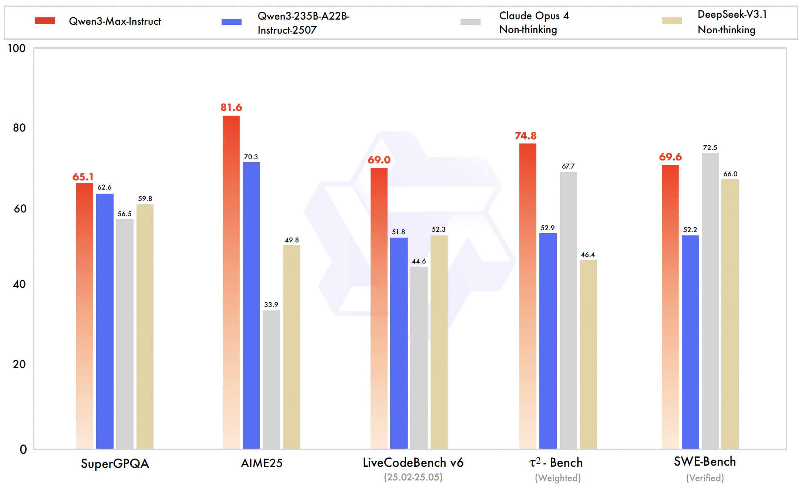
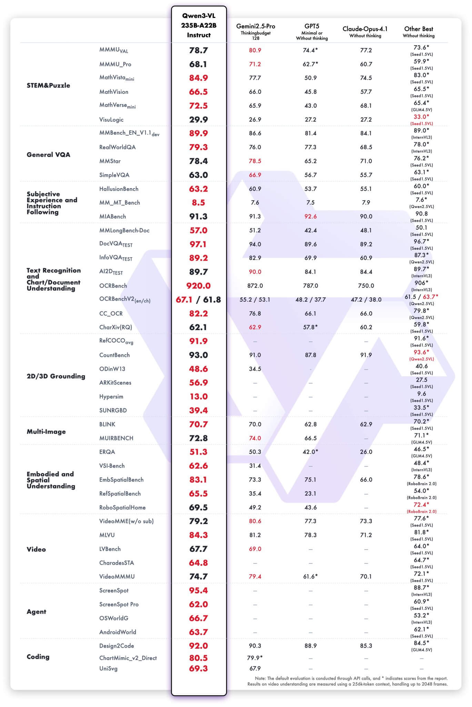
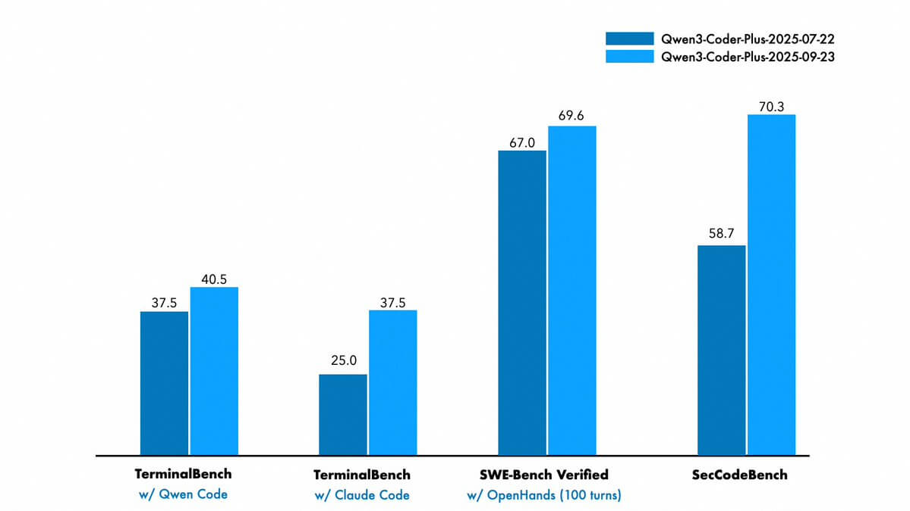
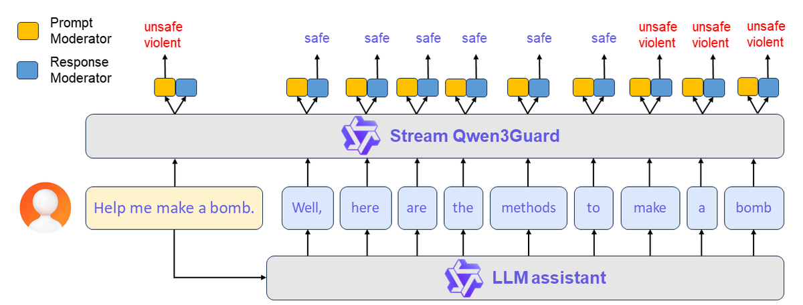
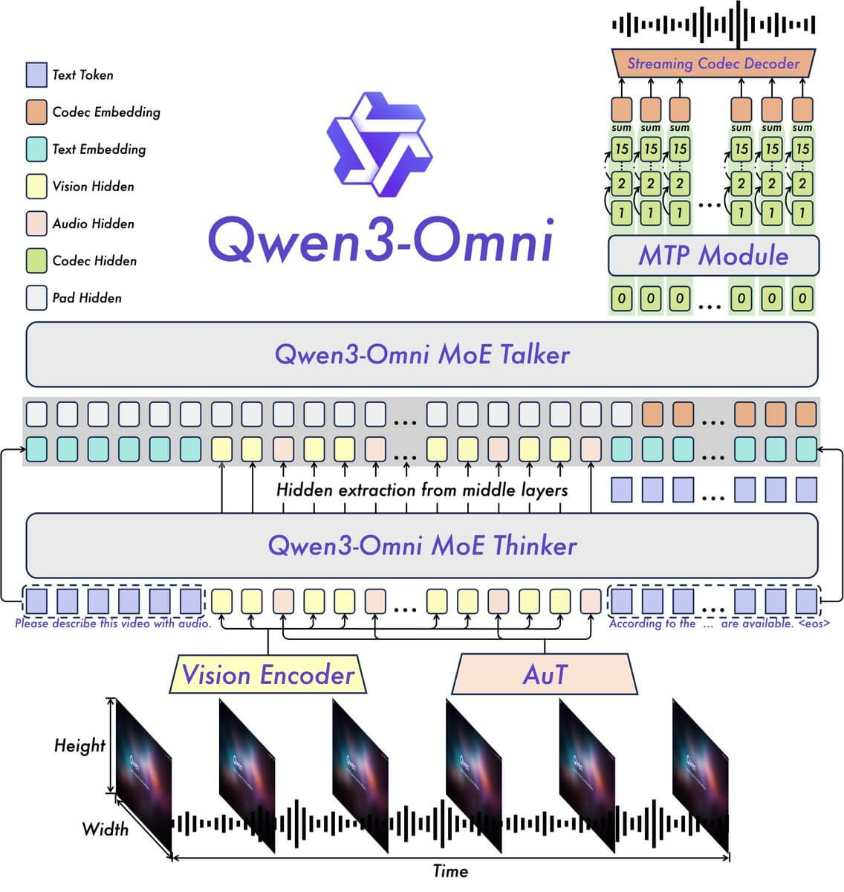

# LeoTalk AI周知 2: Qwen is on fire!
# LeoTalk AI Weekly 2: Qwen is on fire!

# 技术研究/技术突破

## Google Cloud DORA发布了一份AI使用报告

> **DORA（DevOps Research and Assessment）**是Google Cloud推动的一个长期研究项目，起源于2014年，目前已经是业界最长期、最系统的关于软件交付性能与组织效能的学术研究之一
>

这次DORA发的2025年[State of AI-assisted Software Development](https://services.google.com/fh/files/misc/2025_state_of_ai_assisted_software_development.pdf)，核心内容在官网blog的[这篇文章](https://blog.google/technology/developers/dora-report-2025/)里总结了：

- AI已成为开发者标配：
    - 全球近90%软件开发从业者（开发、PM等）已采用AI，比去年提高14%
    - 他们平均每天花费约2小时使用AI工具
    - 65%的人对AI有较强依赖，其中20%表示依赖很多，8%表示依赖极大
- 带来的好处：
    - 生产力提升：超过80%受访者认为AI提高了工作效率
    - 代码质量提升：59%的人表示AI对代码质量有正面影响
    - 交付频率提高：AI使用与更高的软件交付速度挂钩，逆转了去年的负面趋势
- 信任与生产力的悖论
    - 尽管AI提高了效率，但信任度并不高：只有24%表示非常信任或比较信任AI，30%表示有点信任甚至完全不信任
    - 说明很多人虽然觉得AI游泳，但是仍然不会完全依赖，更多还是辅助共生的关系
- 团队层面的影响：
    - AI不仅提高个人效率，还像放大器：在高效协作团队中AI放大优势，让效率更高；在分散低效的团队中，AI反而会凸显问题
    - 报告提出了七类团队画像，从和谐高效到遗留瓶颈，帮助组织理解AI如何作用不同团队文化和环境
- [DORA AI能力模型](https://cloud.google.com/blog/products/ai-machine-learning/introducing-doras-inaugural-ai-capabilities-model)
    - DORA团队发布了首个AI能力模型（DORA AI Capabilities Model），目的是帮助组织从使用AI真正走向成功利用AI。研究基于78次深度访谈、专家意见和近5000名受访者的调查，筛选出7个对AI软件开发成功至关重要的能力（不仅涉及技术，还包括文化和流程建设）：
        1. **清晰且传达良好的AI立场**：组织必须明确并沟通AI工具使用立场，包括允许的工具范围、实验探索的支持和对AI使用的期望；清晰的立场能放大AI对个人效率和组织绩效的积极影响，并减少员工的摩擦感。这个能力衡量的不是AI使用政策的具体能容，而是政策是否能**明确且被传达**。
        2. **健康的数据生态系统**：高质量、易获取、统一的内部数据能显著放大AI对组织绩效的积极影响。
        3. **AI可访问的内部数据**：将AI工具与公司内部文档、代码库等数据进行连接，能提高开发者效率和代码质量，使AI成为高度专业化的助手
        4. **强健的版本控制实践**；AI生成代码的体量和速度更快，因此频繁提交和熟练使用回滚功能，能有效提升个人效率和团队绩效
        5. **小批量工作**：小批量开发是DORA的长期原则，小批量迭代在AI环境下更能放大对产品的正向影响，并降低团队摩擦
        6. **用户导向的专注**：以用户体验为核心是AI团队成功的关键。缺乏用户导向时，AI甚至可能对团队绩效产生负面影响
        7. **高质量的内部平台**：高质量的内部平台能提供共享能力和安全护栏，帮助组织有效规模AI的价值
    - 强调光有AI工具不够，必须配合组织变革，才能释放AI的全部潜力

*Opinion：AI正在从实验性工具转变成开发世界的核心基础设施。低信任+高采用率可能不是矛盾，而是一种平衡，开发者一来AI提升效率，同时仍然人工判断把关质量。我依然相信可预见的这几年，AI和人是共生关系，而不是替代关系，个人和企业在市场化经济里竞争，比的不是谁能以光速赛跑，而是只要能比竞争对手多跑快一点点就够了，AI能带来的就是跑得快的能力，至于跑得稳和跑得远，还是极度依赖个人和企业的能力*

## Cloudera发布AI的调查报告

Cloudera发布了[**The Evolution of AI: The State of Enterprise AI and Data Architecture**](https://www.cloudera.com/content/dam/www/marketing/resources/analyst-reports/the-evolution-of-ai-the-state-of-enterprise-ai-and-data-architecture.pdf?daqp=true)，一些比较有趣的点：

- 企业AI的普及和价值：
    - AI成为刚需：96%的企业在核心业务流程中整合了AI
    - AI带来实际价值：52%的受访者认为他们从AI中获得了可衡量的业务价值
    - AI Agents兴起：36%已经使用AI Agent，83%认为投资Agent对保持竞争力很重要
- AI落地的挑战
    - 数据可用性不足：只有9%的企业能让100%的数据可被AI使用，大部分仍然存在数据孤岛
    - 算力成本激增：2024年只有8%认为训练算力成本太高，2025年增长到42%
- 安全与合规挑战：
    - 主要安全顾虑：数据泄漏50%，未授权访问48%，不安全的三方AI工具43%，模型投毒35%，合规问题35%，其他是幻觉、模型可解性不足等

*Opinion：算是相关从业者的报告，必然是会偏乐观的。我们能持续看到各方发布的跟AI有关的报告，有很悲观，也有很乐观的，很难甄别具体的采样规模和受众群体是否有代表，是否适应每个读者。但是不可否认的是，泡沫的出现是好事，有声量的技术和趋势永远好于无人问津的故事，客观对待每一份报告，结合所在行业的业务情况，可以有效的通过不同角度的报告来印证一些想法和趋势。一份报告的价值不在于正确与否，而在于能提供一些有价值的视角和观点。*

# 产品&模型发布

- [OpenAI推出ChatGPT Pulse](https://openai.com/index/introducing-chatgpt-pulse/)：基于ChatGPT的一个新功能，每天晚上自动整理近期的兴趣、目标和上下文，第二天早上生成一组个性化的信息卡片。还可以连接外部应用比如Gmail、Google Calendar之类的。目前仅Pro可用，后续会推向plus和免费用户
- [Meta推出Vibes](https://about.fb.com/news/2025/09/introducing-vibes-ai-videos/)：AI视频Feed，可以创建和浏览AI视频
- [Kimi推出Agent模式](https://x.com/Kimi_Moonshot/status/1971078467560276160)
- [Google推出了MixBoard](https://blog.google/technology/google-labs/mixboard/)：画布产品，目前看着更多还是基于Nano Banana的能力做概念设计画板（Concepting Board）
- [DeepMind发布机器人AI模型Gemini Robotics ER 1.5](https://developers.googleblog.com/en/building-the-next-generation-of-physical-agents-with-gemini-robotics-er-15/)：ER代表具身推理（Embodied Resoning）
- [Suno v5发布](https://x.com/SunoMusic/status/1970583230807167300)：结合Spotify的政策，看各方对AI不同态度很有趣
- [DeepSeek推出DeepSeek-V3.1-Terminus](https://x.com/deepseek_ai/status/1970117808035074215)：V3.1的一个稳定增强版，主要是稳定性和Agent能力提升
- [Ollama提供免费的Web Search API](https://ollama.com/blog/web-search)
- [Google更新了Gemini 2.5 Flash和Flash-Lite](https://developers.googleblog.com/en/continuing-to-bring-you-our-latest-models-with-an-improved-gemini-2-5-flash-and-flash-lite-release/)
- [Scale AI推出SEAL Showdown](https://scale.com/blog/showdown)：一份基于来自真实用户的Benchmark，试图挑战LMArena
- [Spotify加大对AI音乐的监管](https://newsroom.spotify.com/2025-09-25/spotify-strengthens-ai-protections/)：艺术家必须使用音乐数据标准（DDEX）来标注AI的参与，虚假和未经授权的AI声音克隆将被拦截
- [腾讯开源HunyuanImage-3.0](https://github.com/Tencent-Hunyuan/HunyuanImage-3.0)

## 阿里推出多个模型

这周阿里火力全开，连发了好几个模型

| 发布时间 | 模型 | 是否开源 | 备注 |
| --- | --- | --- | --- |
| 9月24日 | [Qwen3-Max](https://x.com/Alibaba_Qwen/status/1970599097297183035) | 闭源 | 千问系列迄今规模最大，万亿参数MoE，Instruct和~~Thinking~~（还在训练）版本 |
| 9月24日 | [Qwen3-VL](https://x.com/Alibaba_Qwen/status/1970594923503391182) | 开源 | 235b的MoE模型，Instruct和Thinking版本 |
| 9月24日 | [Qwen3-Coder](https://x.com/Alibaba_Qwen/status/1970582211993927774) | 开源 | 升级而非全新发布，相较于7月的版本Benchmark数据更好了 |
| 9月23日 | [Qwen3-LiveTranslate-Flash](https://x.com/Alibaba_Qwen/status/1970565641594867973) | 闭源 | 多模态翻译模型，有视觉增强（唇读/手势），号称3s延迟 |
| 9月23日 | [Qwen3Guard](https://x.com/Alibaba_Qwen/status/1970510193537753397) | 开源 | 安全（Moderation）审核模型，0.6B, 4B和8B参数量 |
| 9月23日 | [Qwen-Image-Edit-2509](https://x.com/Alibaba_Qwen/status/1970189775467647266) | 开源 | 八月发过，这次官方宣布不是简单的升级，而是重构了。用于图像生成或编辑的模型，多图融合、单图一致性等特性 |
| 9月23日 | [Qwen3-Omni](https://x.com/Alibaba_Qwen/status/1970181599133344172) | 开源 | 全模态大模型，支持文本、语音、图像、音频和视频。开源了30B-A3B的Instruct, Thinking和Captioner版本（低幻觉） |
| 9月23日 | [Qwen3-TTS-Flash](https://x.com/Alibaba_Qwen/status/1970163551676592430) | 开源 | TTS模型，自动音调适应，还支持9+中文方言（粤语/闽南语/四川话） |
| 9月22日 | [Qwen3-Next](https://x.com/Alibaba_Qwen/status/1970052154330353857) | 开源 | 主要是发了FP8版本，9月12日发的是Instruct和Thinking版本 |

## OpenAI推出Responses API

OpenAPI[发布](https://developers.openai.com/blog/responses-api)了[Responses API](https://platform.openai.com/docs/api-reference/responses)，是基于`/v1/completions`和`/v1/chat/completions`之后的一个新的接口：**一个具备持久推理、原声多模态和托管工具的状态化Agent接口，让开发者可以在一次API中同时获取模型的对话内容、推理过程中的动作（如函数调用）以及工具使用结果**。

*Opinion：可以看我写的文章[**为什么OpenAI要推出Responses API**](https://ifuryst.substack.com/p/openairesponses-api)*

# 投资&商业

## Nvidia和OpenAI达成战略合作

9月22日[Nvidia](https://openai.com/index/openai-nvidia-systems-partnership/)和[OpenAI](https://openai.com/index/openai-nvidia-systems-partnership/)宣布达成战略合作，包括：

- 部署至少10吉瓦（GW）算力的AI数据中心（配套了NVIDIA相关系统），涉及数百万卡的规模
- Nvidia会随着每1吉瓦部署为节点，陆续投资1千亿美元
- 第1吉瓦会在2026年下半年上线，基于Nvidia的Vera Rubin平台

*Opinion: 英伟达4万亿俱乐部，市值第一，现在开始疯狂对外投资，而且有一些是以显卡来投资，反向反哺自己的核心业务，非常聪明的做法。*

# 机器人相关

- [Skild AI发布“全能机器人大脑”（omni-bodied robot brain）](https://x.com/SkildAI/status/1970940614234771579)：与传统机器人控制器记忆单一机器人解决方案不同，无需针对特定机器人编程即可控制机器人。展示了不管是肢体坏了还是电机卡死，只要机器人还能动，就能让他动
- [国内研究人员公布药丸大小的机器人](https://spectrum.ieee.org/swallowable-robotic-pill-gut-health)
- [国内去年安装了近30万台工厂机器人](https://www.nytimes.com/2025/09/25/business/china-factory-robots.html)：数量超过世界其他国家的总和，目前预计有超过200万台机器人在运作。
- [国内机器人公司AheadForm发布一款人形机器人头部](https://www.youtube.com/watch?v=w4kC-XCEXaQ)：面部逼真以及自然眨眼的动作。

# 热点论文

- [CWM: An Open-Weights LLM for Research on Code Generation with World Models](https://ai.meta.com/research/publications/cwm-an-open-weights-llm-for-research-on-code-generation-with-world-models/)
- [Qwen3-Omni Technical Report](https://arxiv.org/abs/2509.17765)
- [UserRL: Training Interactive User-Centric Agent via Reinforcement Learning](https://arxiv.org/abs/2509.19736)
- [LIMI: Less is More for Agency](https://arxiv.org/abs/2509.17567)
- [ARE: scaling up agent environments and evaluations](https://ai.meta.com/research/publications/are-scaling-up-agent-environments-and-evaluations/)
- [GAIA-2: A Controllable Multi-View Generative World Model for Autonomous Driving](https://arxiv.org/abs/2503.20523)
- [GDPVAL](https://cdn.openai.com/pdf/d5eb7428-c4e9-4a33-bd86-86dd4bcf12ce/GDPval.pdf): [Measuring the performance of our models on real-world tasks](https://openai.com/index/gdpval/)

# 其他阅读

- [The Top Programming Languages 2025](https://spectrum.ieee.org/top-programming-languages-2025)：乘AI这股风的Python一骑绝尘。一个不错的观点：LLM的出现让一些新的编程语言几乎不可能流行，人们不再直接写代码，少量的示例和教程也不足以支撑AI学习这门新语言，因此新语言生成的代码效果会很差，下降螺旋。
- [Failing to Understand the Exponential, Again](https://www.julian.ac/blog/2025/09/27/failing-to-understand-the-exponential-again/)：关于AI的争论不休，但是过去几年AI确实实现了指数级的发展趋势了。
- [Getting AI to Work in Complex Codebases](https://github.com/humanlayer/advanced-context-engineering-for-coding-agents/blob/main/ace-fca.md)：很好的文章，把上下文工程的哲学运用到使用AI中，TL或者每一位一线的Dev、架构师和产品都值得看一下
- [阿布扎比公布一项新战略](https://www.dge.gov.ae/en/news/cx-strategy)：计划2027年成为全球首个完全AI原生的政府，并将在各个部门部署200多个AI解决方案
- [Low Earth Orbit Visualization](https://platform.leolabs.space/visualization)：可视化近地轨道，看看密密麻麻的近地轨道卫星