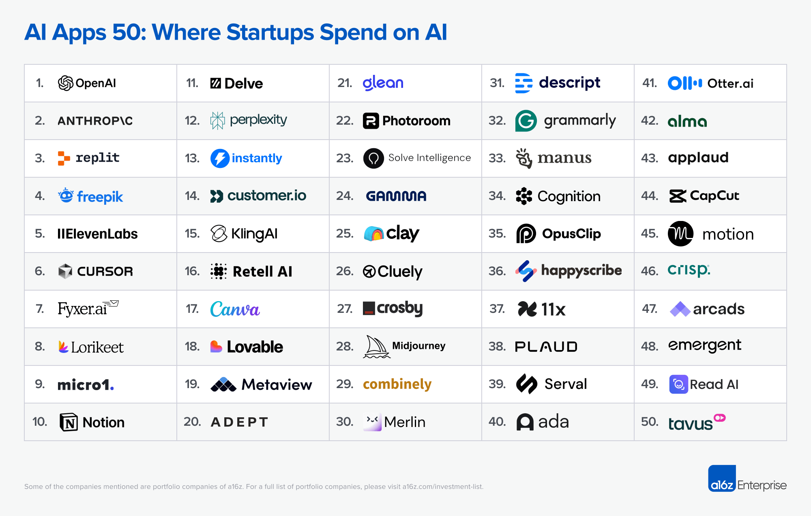
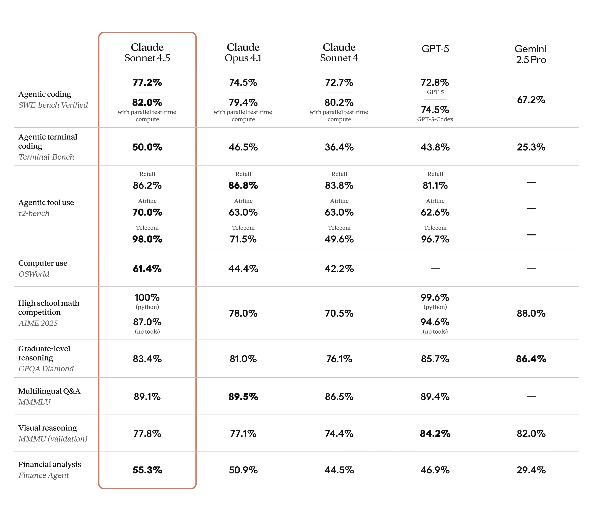
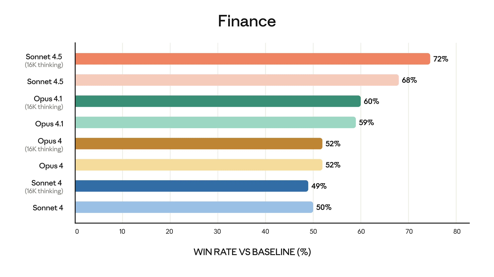
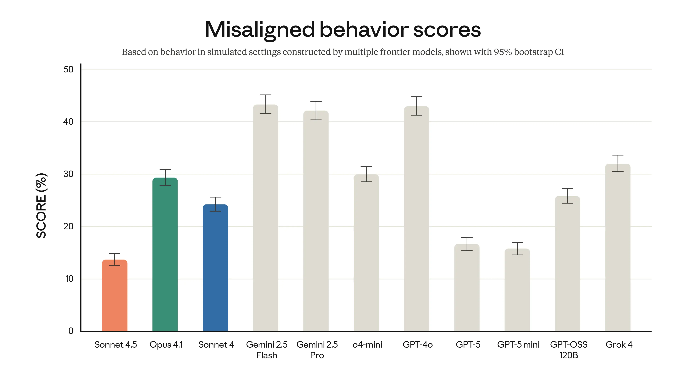
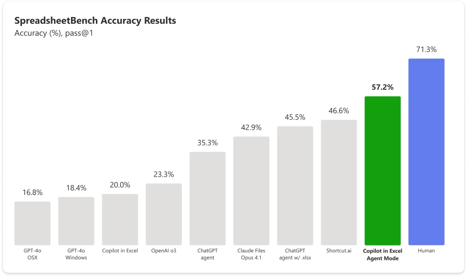

# LeoTalk AI周知 3: 追求差异化的最后一公里
# LeoTalk AI Weekly 3: Beyond the Model Race, Toward the Last Mile of Differentiation
小公司不必一直追模型，而是做好差异化的最后一公里。

目前LLM不管是闭源还是开源都已经到达了一个效果很不错的水平了，在很多Benchmark和实际应用都得到了证明。随着目前SOTA大模型Scaling Law得到的收益趋缓，AI应用升级到最新的大模型的边际收益也会变小。在实际生产中应该着重关注最后一公里的价值体现。

这里面可以有多种价值体现方式。最常见的是结合行业或者垂直领域的知识进行应用，通过AI Agent结合后阶段（如RL）做微调，可以最大化模型能力，在应用层结合一些实际的workflow来设计和构建，可以实现真正有价值的AI应用或工作流。

VLM也是现在备受关注的方向，甚至在Switcher/Router层面，不一定需要LLM来做，VLM可以运用的场景有很多

如何能最大化利用现有模型能力去创造价值或者赋能业务，是企业更应该关心的。也是初创企业的机会所在，保持敏感性，用AI思维去思考每一个已经习以为常的场景。

最后一公里是一个泛指的定义，但是确实价值最大化，性价比最高的阶段。

# 技术研究/技术突破

## a16z发布人工智能消费报告

a16z发布[**The AI Application Spending Report: Where Startup Dollars Really Go**](https://a16z.com/the-ai-application-spending-report-where-startup-dollars-really-go/)。a16z分析了2025年6-8月间超过20万家初创公司的支出数据，从中识别出前50家AI原生应用公司（AI-native application companies）

榜单揭示了哪些在花钱、购买什么样的AI应用。

1. 横向应用（Horizontal Apps）占多数：60%横向应用，40%垂直应用：
    - 通用LLM助手：OpenAI、Anthropic、Perplexity、Merlin AI
    - 工作区类别工具：Notion、Manus
    - 会议类工具：Fyxer、Happyscribe、Plaude、Otter AI、Read AI
    - 创意类工具（最大单一类别）：Freepik、ElevenLabs、Canva、Photoroom、Midjourney、Descript、Opus Clip、Capcut、Arcads、Tavus
2. 垂直应用（Vertical Apps）：增强人类vs替代人类：
    - 增强类（12家）：帮助员工减少重复工作，如客服、销售、HR工具等
    - 替代类（5家）：AI完成整个业务流程，如AI律师、AI工程师等
3. Vibe Coding已经进入企业级
    - 以Replit、Cursor、Lovable、Emergent为主，使得Vibe Coding从消费者端转向了企业端
4. 从Consumer→Prosumer→Enterprise的演化路径
    - 约70%产品可以个人直接消费
    - 很多AI产品短时间内完成了从C端切入到企业应用
    - AI产品模糊了个人工具和企业软件的界限

*Opinion：今年应用层的增速是很大的，模型层热转向了应用层热。企业更有意愿也有更多预算投入到AI。这个趋势在2026年会持续加深，2025H2可以明显感觉到B端对于AI Agent的狂热追求，应用也进一步往垂类和私域渗透。*

# 产品&模型发布

- [OpenAI推出Agentic Commerce Protocol](https://openai.com/index/buy-it-in-chatgpt/)：更像是和Google的[AP2](https://github.com/google-agentic-commerce/AP2)竞争
- DeepSeek[推出](https://api-docs.deepseek.com/news/news250929)**DeepSeek-V3.2-Exp**，相关[技术报告](https://github.com/deepseek-ai/DeepSeek-V3.2-Exp/blob/main/DeepSeek_V3_2.pdf)
- Thinking Machines Lab[推出](https://thinkingmachines.ai/blog/announcing-tinker/)[**Tinker**](https://thinkingmachines.ai/tinker/)：一个用于微调大语言模型的灵活API平台，研究者和开发者能自行控制算法与数据，系统负责分布式训练与资源管理
- Anthropic[推出](https://www.anthropic.com/engineering/building-agents-with-the-claude-agent-sdk)**Claude Agent SDK**
- 智谱AI[发布](https://z.ai/blog/glm-4.6)[**GLM-4.6**](https://docs.z.ai/guides/llm/glm-4.6)
- Opera[发布](https://www.operaneon.com/)Neon（AI浏览器）
- Hume AI[发布](https://www.hume.ai/blog/octave-2-launch)多模态TTS模型Octave-2

## Anthropic发布Claude Sonnet 4.5

Anthropic[推出](https://www.anthropic.com/news/claude-sonnet-4-5)**Claude Sonnet 4.5**

*Opinion：看着是为了应对GPT-5发布会后强劲的势头。现在cc默认也是走4.5了。可以发现现在Coding模型会开始着重一个指标，最长可自主运行时间，这点上Sonnet4.5标榜了30小时。*

## OpenAI发布Sora2

OpenAI[发布](https://openai.com/index/sora-2/)Sora2。同时发布了Sora APP，可以理解为AI生成视频领域的TikTok。另外这次Sora2采用了邀请制。

*Opinion：发布后几天内，Sora2席卷全球，自媒体狂欢，邀请码机制更是增加了FOMO心理，助推了裂变。感觉现在邀请机制属于AI产品的常用套路了，用得好确实是有助理的。Sora APP也连续登顶App Store。大家也在持续讨论Sora2是否是可行的路径，Sam也在4号在他的Blog里发了一篇文章表示OAI打算开始和IP方合作分成，进一步探索商业化路径。目前一些知名IP已经无法简单的Gen出来了。另外国内目前针对Sora和邀请码的关键词进行了全网屏蔽，原因未知。回到Sora 2的狂欢本身，很难非黑即白的去评价，不要过度狂欢，也不要视而不见，积极探索发现其背后的商业价值。*

# 微软推出Office Agent

微软[推出](https://www.microsoft.com/en-us/microsoft-365/blog/2025/09/29/vibe-working-introducing-agent-mode-and-office-agent-in-microsoft-365-copilot/)Office Agent，在Word，Excel中可以有Agent模式了（这是一个其他AI Agent产品很早就实现的功能）

另外Nadlla也宣布自己会将一些对外的事务转移由CCO负责，自己专注于重视内部的RD。MC在Office上的竞争日益激烈，在数据中心层面也面临了越来越激烈的竞争，甚至合作伙伴OAI都要自己建数据中心了

*Opinion：微软的AI进度和成功在MAG7里不是很好，更多还是在数据中心和云服务（包括AI推理）层面的收入，Office结合AI包括定价策略的调整和最终结果都表明用户不太买账。微软还需要在AI上持续投入和发力。相比之下Google现在已经慢慢跟上来并在多个方面实现反超了。*

## Comet免费使用

Perplexity[宣布](https://x.com/perplexity_ai/status/1973795224960032857)Comet（AI浏览器）可免费使用了，原来只能付费用户使用

*Opinion：Chrome已经在US开始试点侧边栏AI功能了，标志着AI浏览器下半场开始了。AI浏览器是未来很重要的一个流量入口，期待各家持续竞争下能产出一些对普通用户有价值的产品或者新的交互形态*

# 热点论文

- [**The Unreasonable Effectiveness of Scaling Agents for Computer Use**](https://arxiv.org/abs/2510.02250)
- [**JoyAgent-JDGenie: Technical Report on the GAIA**](https://arxiv.org/abs/2510.00510)
- [**Self-Forcing++: Towards Minute-Scale High-Quality Video Generation**](https://arxiv.org/abs/2510.02283)

# 其他阅读

- https://www.anthropic.com/engineering/effective-context-engineering-for-ai-agents
- [**Modular Manifolds**](https://thinkingmachines.ai/blog/modular-manifolds/)：探讨了如何用流形（manifold）约束和几何优化的视角来重新思考神经网络训练
- [**LoRA Without Regret**](https://thinkingmachines.ai/blog/lora/)：探讨了LoRA的实际权衡与取舍，并提供了关于超参数选择、秩（rank）设定以及与其他技术结合使用的实用指导
- [**Awesome-Nano-Banana-images**](https://github.com/PicoTrex/Awesome-Nano-Banana-images)：很多Nano-banana的使用方式展示
- [**Building with Cursor (public)**](https://www.notion.so/273da74ef0458051bf22e86a1a0a5c7d?pvs=21)：Cursor内部针对非工程的新人Onboarding的指导
- 微软[推出](https://azure.microsoft.com/en-us/blog/introducing-microsoft-agent-framework/)[**Agent Framework**](https://github.com/microsoft/agent-framework)：A framework for building, orchestrating and deploying AI agents and multi-agent workflows with support for Python and .NET.
- [AI-Generated “Workslop” Is Destroying Productivity](https://hbr.org/2025/09/ai-generated-workslop-is-destroying-productivity)
- [OpenAI上半年43亿美元营收，在RD上投入了25亿美元](https://www.theinformation.com/articles/openais-first-half-results-4-3-billion-sales-2-5-billion-cash-burn)